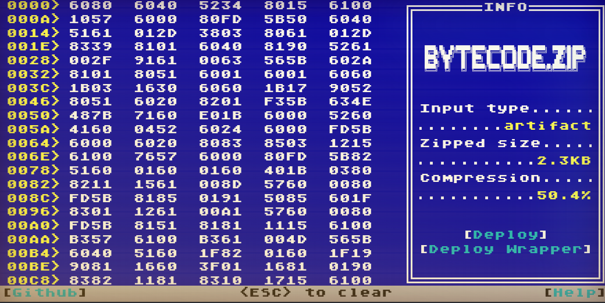
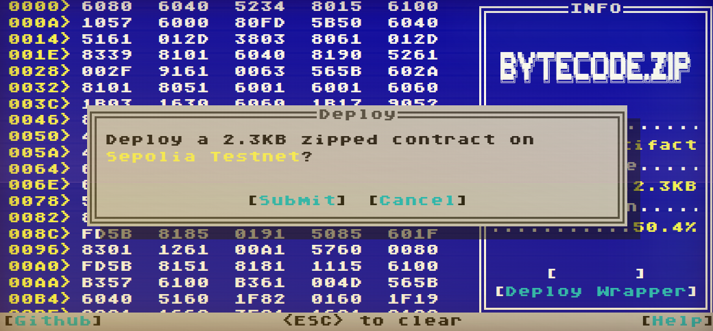
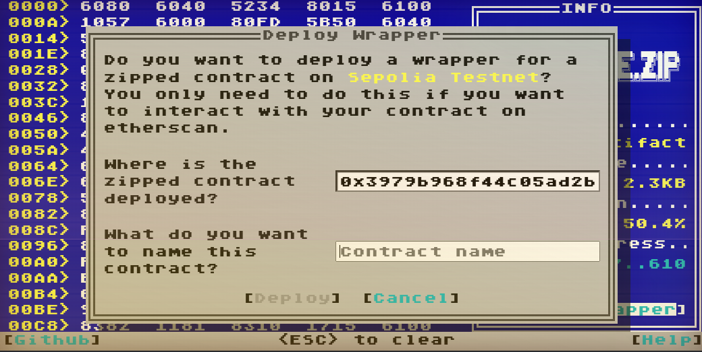
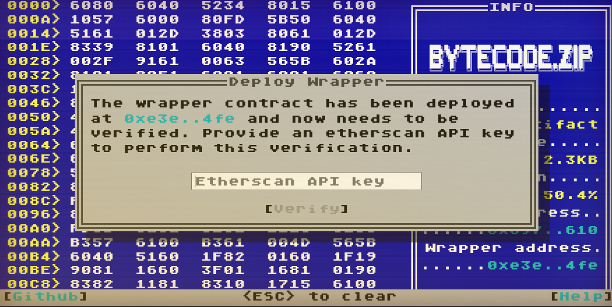

# bytecode.zip Quickstart

[bytecode.zip](https://bytecode.zip) lets you deploy [zipped contracts](https://github.com/merklejerk/zipped-contracts) and [wrapper contracts](#deploy-a-wrapper-contract) from your browser. It supports Ethereum mainnet, Goerli testnet, and Sepolia testnet networks. As always, you should ensure your contract works on a testnet before deploying to mainnet. 

### Provide the Unzipped Bytecode
To get started, you can provide either raw initcode or a build artifact for the contract you want to zip.

**Option 1: Providing Raw Initcode (Advanced)**

To provide raw (hex) initcode, just paste the compiled creation/init code for a compiled contract anywhere on the app. Note that this is the bytecode used to deploy a contract, which is distinct from what is known as the "runtime bytecode" of the contract (what actually gets stored on chain). If the contract's constructor accepts arguments, then you should ABI-encode and append them to the initcode.

> ⚠️ The app cannot verify the correctness of the provided initcode, and you will not be able to test its validity until after deployment, so be careful to provide the correct initcode.

**Option 2: Providing a Build Artifact (Recommended)**

The simpler method is just to provide the raw build/output artifact generated from solc, foundry, hardhat, or remix. This will be in the form of a JSON file which includes build results such as the contract ABI, and bytecode(s). Constructor arguments do not currently work with this method, so you must provide a contract that does not accept constructor arguments.

> ℹ️ In order to optionally generate a [wrapper contract](#deploy-a-wrapper-contract), you *must* provide a full build artifact.

### Deploy a Zipped Contract

Once you've provided your contract's initcode, you will be given the option to deploy a self-extracting, zipped version of it. You can proceed by clicking "**Deploy**", where you will be prompted to connect your wallet and confirm the deployment transaction.

After deploying the zipped contract, you can stop there or continue to deploy a wrapper contract.

### Deploy a Wrapper Contract

Zipped contracts cannot have their source verified on etherscan. So if you need users to be able to query your zipped contracts via etherscan's UI you will need to deploy a verifiable wrapper contract that forwards calls to your zipped contract. You can write one manually, duplicating each public function yourself, or you can let bytecode.zip generate one automatically for you.

If you have provided a build artifact to the app, you will be given the option to deploy a wrapper. This option is available even if you haven't deployed a zipped contract in the same session, so you can always postpone this step until much later, assuming you do not lose the original contract's build artifact.

Clicking on **Deploy Wrapper** will prompt you to enter some details about the wrapper contract. First is the address of the zipped contract. If you've deployed one in the same session then this will already be filled in. If not, you can provide it manually. Second is the name of the wrapper contract. This is entirely up to you, but should probably match the name of the original (unzipped) contract. Once these two have been provided, the wrapper contract will be generated, compiled, and you can go on to confirming the deployment transaction.

Once the transaction has been mined, you will be prompted to verify the deployed wrapper contract. *It's important not to miss this step*, as having a verified interface to your zipped contract is the entire point of creating a wrapper contract! To proceed, you will need to provide an etherscan API key. If you don't have one, you can visit `etherscan.io` and generate one for free by creating an account. This key will not be stored anywhere. Once you've provided your etherscan API key, the app will provide the contract verification details to etherscan and after a short moment your wrapper contract should be verified!

